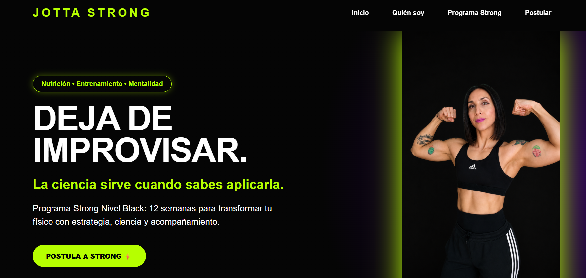
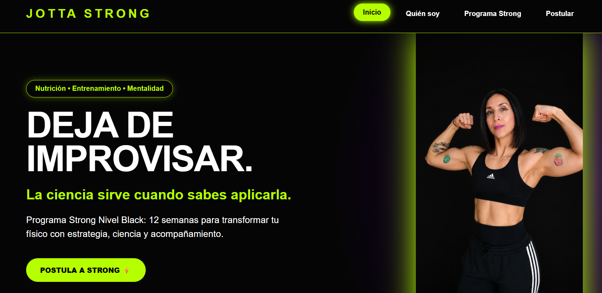
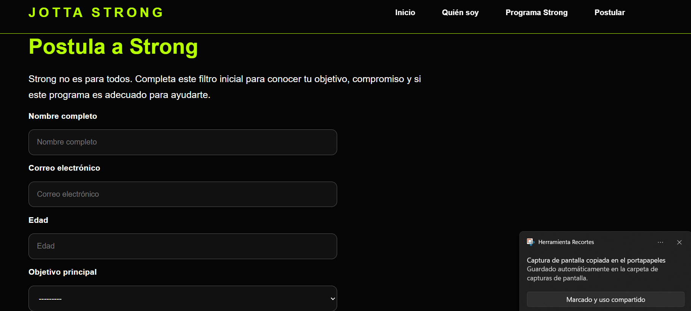
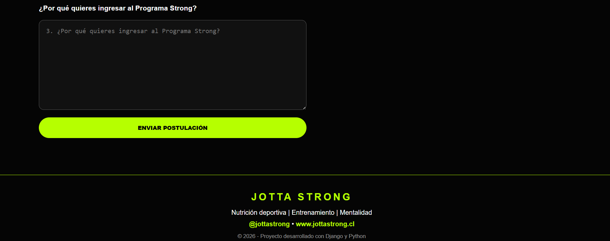
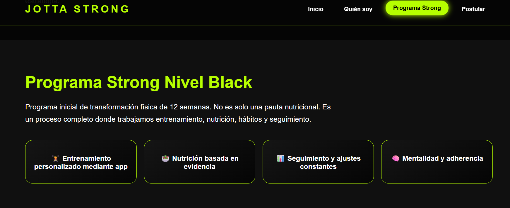
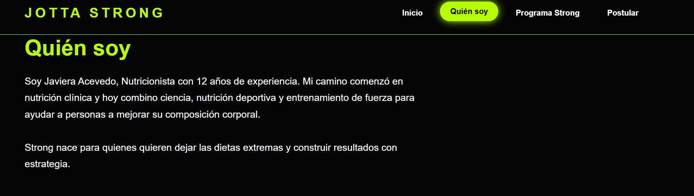
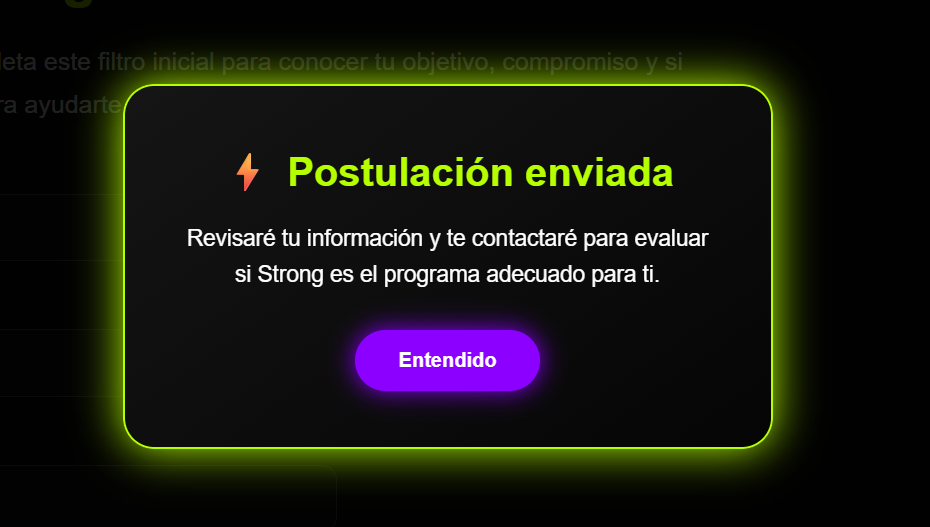

# Jotta Strong - Plataforma Web Django 🐍⚡
## Vista previa del proyecto

### Home

### Botones menu

### Postulación al programa

### Parte del Formulario de postulacion

### Programa Strong

### quien soy

### Postulación exitosa

## Descripción del proyecto

Jotta Strong es una aplicación web desarrollada con Python y Django para la gestión inicial de postulaciones al Programa Strong Nivel Black.

El objetivo del proyecto es crear una plataforma que permita presentar un programa de nutrición deportiva y entrenamiento, además de capturar información de usuarios interesados mediante un formulario conectado a base de datos.

## Funcionalidades principales

- Landing page responsive.
- Presentación del Programa Strong.
- Sección de información profesional.
- Formulario de postulación.
- Validación de campos obligatorios.
- Registro de postulantes en base de datos.
- Panel administrativo para gestión de usuarios.
- Mensajes dinámicos de confirmación.

## Tecnologías utilizadas

- Python
- Django
- HTML5
- CSS3
- JavaScript
- SQLite

## Arquitectura utilizada

El proyecto utiliza el patrón MVT propio de Django:

- Model: creación del modelo Postulante.
- View: procesamiento de formularios y lógica.
- Template: interfaz visual del usuario.

## Modelo principal

Postulante:

- Nombre completo
- Correo electrónico
- Edad
- Objetivo
- Nivel de compromiso
- Dificultad actual
- Experiencia previa
- Motivación
- Fecha de registro

## Instalación del proyecto

Clonar repositorio:
