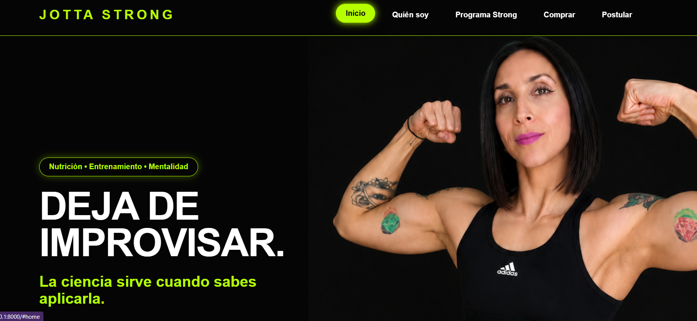
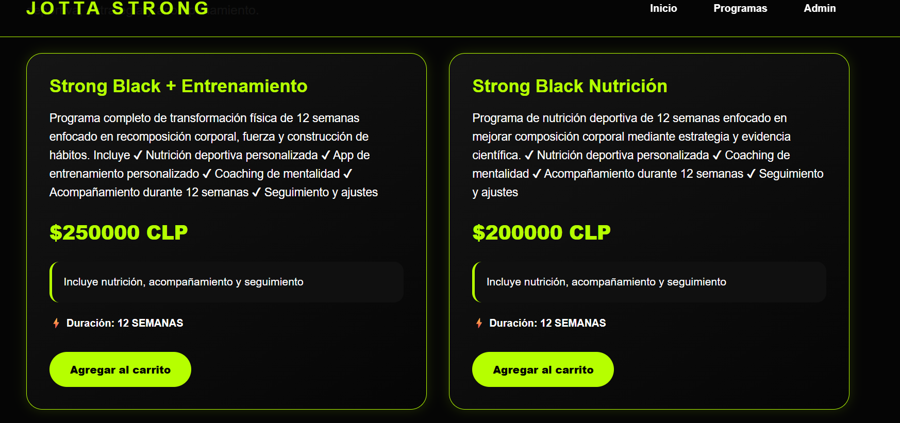
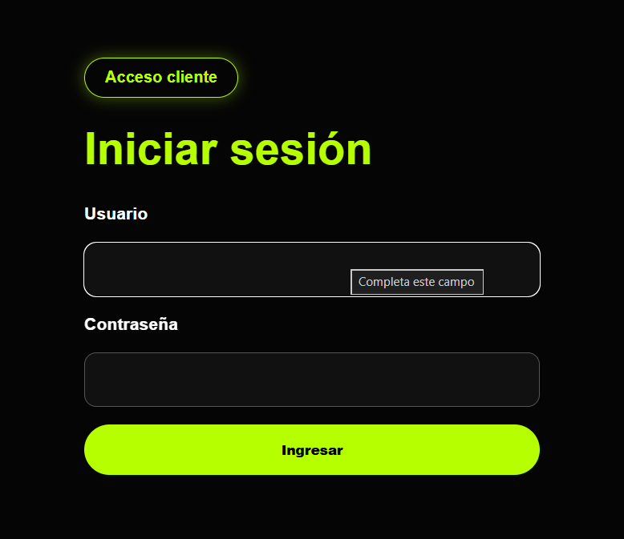
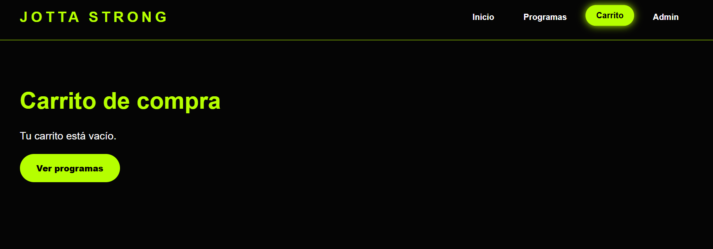
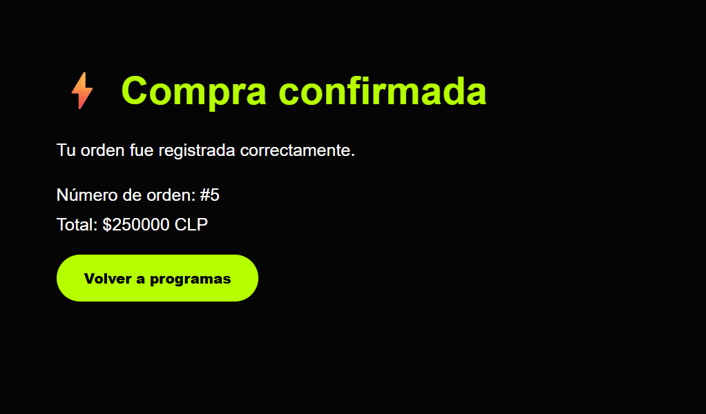
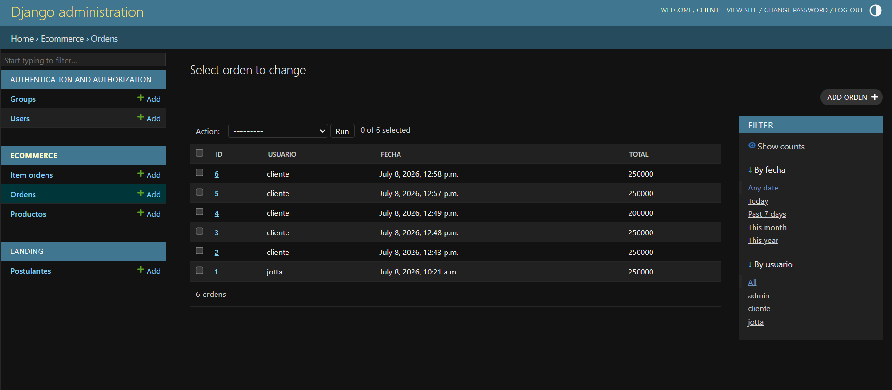
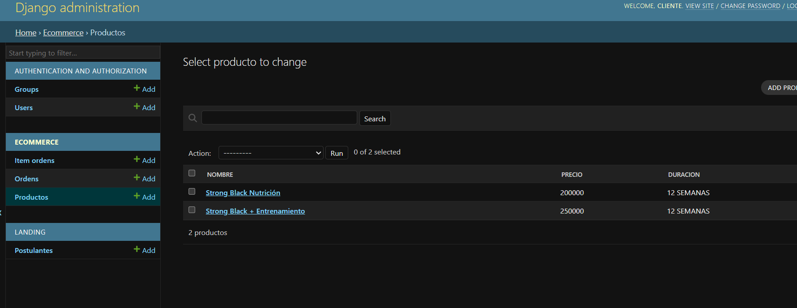

# Jotta Strong Ecommerce - Django 🐍⚡

## Descripción del proyecto

Jotta Strong Ecommerce es una aplicación web desarrollada con Python y Django como proyecto final de portafolio Fullstack.

La plataforma permite gestionar la venta del Programa Strong Nivel Black mediante un flujo completo de ecommerce:

- Visualización de programas.
- Autenticación de usuarios.
- Catálogo conectado a base de datos.
- Carrito de compras.
- Confirmación de compra.
- Registro de órdenes.
- Administración de productos mediante Django Admin.

Además, cuenta con una landing page profesional orientada a nutrición deportiva, formulario de postulación y gestión de potenciales clientes.

---

# Vista previa del proyecto

## Home / Landing



## Catálogo Ecommerce



## Login Cliente



## Carrito de compras



## Compra confirmada



## Administración de órdenes



## Administración de productos



---

# Funcionalidades implementadas

✔ Landing page responsive.

✔ Formulario de postulación conectado a base de datos.

✔ Validaciones de formulario.

✔ Login de usuarios.

✔ Gestión de roles mediante Django Auth.

✔ Catálogo dinámico desde base de datos.

✔ Administración de productos.

✔ Carrito de compras.

✔ Agregar y eliminar productos del carrito.

✔ Cálculo automático de subtotal y total.

✔ Confirmación de compra.

✔ Registro de órdenes asociadas al usuario.

✔ Panel administrador Django.

---

# Tecnologías utilizadas

- Python
- Django
- HTML5
- CSS3
- JavaScript
- SQLite
- Git / GitHub

---

# Arquitectura

El proyecto utiliza el patrón MVT de Django:

## Model

Gestión de modelos y base de datos mediante ORM.

Modelos principales:

### Postulante

- Nombre
- Correo
- Objetivo
- Experiencia
- Motivación
- Fecha registro

### Producto

- Nombre
- Descripción
- Precio
- Duración
- Incluye

### Orden

- Usuario
- Fecha
- Total

### ItemOrden

- Producto
- Cantidad
- Subtotal

---

# Instalación del proyecto

Clonar repositorio:

```bash
git clone https://github.com/Jottaacevedo89/JottaStrong-Django.git
```

Entrar al proyecto:

```bash
cd JottaStrong-Django
```

Crear entorno virtual:

```bash
python -m venv venv
```

Activar entorno en Windows:

```bash
venv\Scripts\activate
```

Instalar dependencias:

```bash
pip install -r requirements.txt
```

Crear base de datos y aplicar migraciones:

```bash
python manage.py migrate
```

Crear usuario administrador:

```bash
python manage.py createsuperuser
```

Ejecutar servidor:

```bash
python manage.py runserver
```

Abrir en navegador:

```bash
http://127.0.0.1:8000/
```

---

# Rutas principales

Landing:

```bash
http://127.0.0.1:8000/
```

Catálogo:

```bash
http://127.0.0.1:8000/programas/
```

Carrito:

```bash
http://127.0.0.1:8000/carrito/
```

Login:

```bash
http://127.0.0.1:8000/login/
```

Administrador:

```bash
http://127.0.0.1:8000/admin/
```

---

# Acceso administrador

Desde Django Admin se pueden gestionar:

- Productos del programa.
- Órdenes de compra.
- Usuarios registrados.
- Postulaciones recibidas.

---

# Usuarios de prueba usados en desarrollo local

## Administrador

Usuario:

```bash
admin
```

Contraseña:

```bash
admin123
```

## Cliente

Usuario:

```bash
cliente
```

Contraseña:

```bash
cliente123
```

---

# Nota importante

La base de datos SQLite no se incluye en el repositorio por buenas prácticas de desarrollo.

Por eso, al clonar el proyecto desde GitHub, se debe crear una nueva base de datos local con:

```bash
python manage.py migrate
```

Luego se debe crear un usuario administrador con:

```bash
python manage.py createsuperuser
```

Para probar el ecommerce completo:

1. Crear un superusuario.
2. Ingresar al panel administrador.
3. Crear productos desde Django Admin.
4. Entrar al catálogo.
5. Agregar productos al carrito.
6. Confirmar compra.
7. Revisar la orden creada en el panel administrador.

---

# Autora

Javiera Acevedo

Nutricionista deportiva y estudiante Fullstack Python/Django.

Proyecto que integra nutrición deportiva, tecnología y desarrollo web.